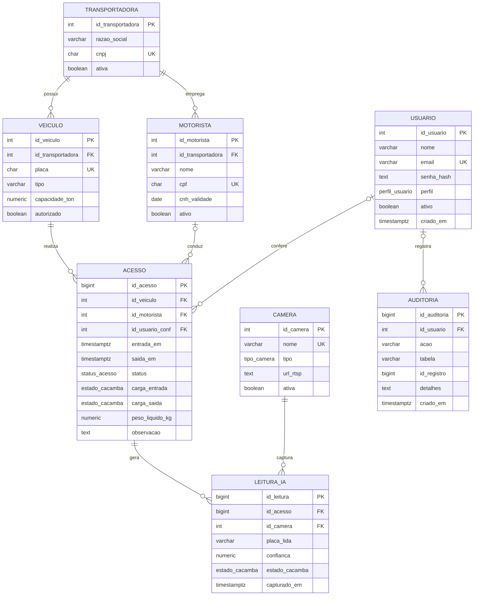

# Diagrama do Modelo Lógico (Mermaid)

```mermaid
erDiagram
    TRANSPORTADORA ||--o{ MOTORISTA : "emprega"
    TRANSPORTADORA ||--o{ VEICULO : "possui"
    VEICULO ||--o{ ACESSO : "realiza"
    MOTORISTA |o--o{ ACESSO : "conduz"
    USUARIO |o--o{ ACESSO : "confere"
    ACESSO ||--o{ LEITURA_IA : "gera"
    CAMERA ||--o{ LEITURA_IA : "captura"
    USUARIO |o--o{ AUDITORIA : "registra"

    TRANSPORTADORA {
        int id_transportadora PK
        varchar razao_social
        char cnpj UK
        boolean ativa
    }
    MOTORISTA {
        int id_motorista PK
        int id_transportadora FK
        varchar nome
        char cpf UK
        date cnh_validade
        boolean ativo
    }
    VEICULO {
        int id_veiculo PK
        int id_transportadora FK
        char placa UK
        varchar tipo
        numeric capacidade_ton
        boolean autorizado
    }
    USUARIO {
        int id_usuario PK
        varchar nome
        varchar email UK
        text senha_hash
        perfil_usuario perfil
        boolean ativo
        timestamptz criado_em
    }
    CAMERA {
        int id_camera PK
        varchar nome UK
        tipo_camera tipo
        text url_rtsp
        boolean ativa
    }
    ACESSO {
        bigint id_acesso PK
        int id_veiculo FK
        int id_motorista FK
        int id_usuario_conf FK
        timestamptz entrada_em
        timestamptz saida_em
        status_acesso status
        estado_cacamba carga_entrada
        estado_cacamba carga_saida
        numeric peso_liquido_kg
        text observacao
    }
    LEITURA_IA {
        bigint id_leitura PK
        bigint id_acesso FK
        int id_camera FK
        varchar placa_lida
        numeric confianca
        estado_cacamba estado_cacamba
        timestamptz capturado_em
    }
    AUDITORIA {
        bigint id_auditoria PK
        int id_usuario FK
        varchar acao
        varchar tabela
        bigint id_registro
        text detalhes
        timestamptz criado_em
    }
```
